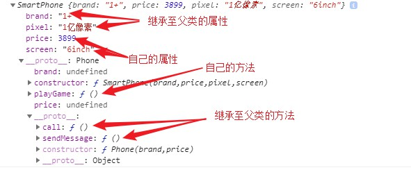
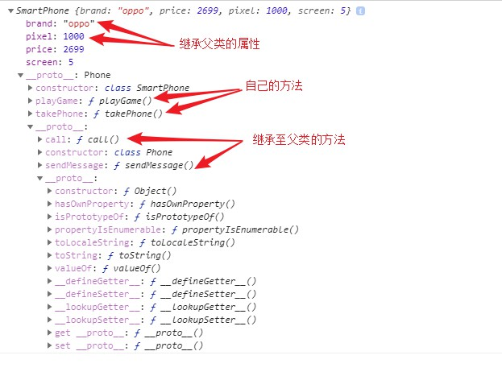

## 一、class 类

ES6 提供了更接近传统语言的写法，引入了 Class（类）这个概念，作为对象的模板。通过class关键字，可以定义类。基本上，**ES6 的class可以看作只是一个语法糖**，它的绝大部分功能，ES5 都可以做到，新的class写法只是让对象原型的写法更加清晰、更像面向对象编程的语法而已。

###　1. 回顾与新知
#### 用构造函数的方法定义一个类
```js
// 定义构造函数
function Phone(brand,price){
    this.brand = brand;
    this.price = price;
    sendMessage = function(){
        coosole.log('我可以发信息')
    }
    this.use = function(){
        console.log('我还可以用来拍人')
    }
}
// 在构造函数的显示原型上添加方法
Phone.prototype.call = function(){
    cosole.log('我可以打电话')
}
// 实例化对象
const moto = new Phone('摩托罗拉',4000)
console.log(moto)；//hone {brand: "摩托罗拉", price: 4000}
moto.sendMessage();//new出来的实例对象，不能直接调用构造函数中没有加this的方法；会报如下错误：Uncaught TypeError: moto.sendMessage is not a function
moto.use();//我还可以用来拍人
moto.call();//我可以打电话
```
#### 用class定义一个类
用class定义类的属性时，`constructor`关键字不能忘。

```js
class Phone{
    //  构造方法(添加属性)，类的内部只能存在一个constructor方法 
    constructor(brand,price){
        this.brand = brand;
        this.price = price;
    }
    //  添加方法
    call(someone){
        console.log('我可以给'+someone+'打电话')
    }//用class定义类时，添加的方法的底层实现是直接将方法加在了类的显示原型上，所以new出来的实例可以直接使用。
    sendMessage = function(){
        console.log('123')
    }//用class定义类的时候，添加方法时不能写 = function ,会报如下错误：Uncaught SyntaxError: Unexpected token = 
}

const huawei = new Phone('华为'，2500)
console.log(huawei);//Phone {brand: "华为", price: 2500}
huawei.call('老高');//我可以给老高打电话
```
### 2. 静态成员
属于类的成员，称之为静态成员(构造函数中有，实例对象中没有)
#### 用构造函数添加静态成员
```js
function Phone (){
    <!-- 添加成员 -->
    Phone.name = '手机'
    Phone.change = function(){
        console.log('change the world')
    }
}
let xiaomi =  new Phone();
cosole.log(xiaomi);//Phone {}
xiaomi.change();//uncaught TypeError: xiaomi.change is not a function
```
#### 用class类添加静态成员
用class类添加静态成员时，关键字`static`不能忘。
```js
class Phone(){
    <!-- 静态成员 -->
    static name = '手机'
    static change = function (){
        console.log('改变世界')
    }
}

const smartPhone = new Phone();
console.log(smartPhone);//{}
```

### 3. 继承
当**某一个类**实现了当前需要的功能，就可以继承该类，使用其对应的方法即可。

#### 用构造函数实现继承

```js
<!-- 定义父类 -->
// 定义构造函数
function Phone(brand,price){
    this.brand = brand;
    this.price = price;
}
// 添加方法
Phone.prototype.call = function(){
    cosole.log('我可以打电话')
}
Phone.prototype.sendMessage = functionn(){
    console.log('发短信')
}

<!-- 定义子类 -->
// 子类的构造函数
function SmartPhone(brand,price,pixel,screen){
    // 调用父类的构造方法
    Phone.call(this,brand,price);
    // 子类属性初始化
    this.pixel = pixel;
    this.screen = screen;
}

// 子类继承父类的方法
SmartPhone.prototype = new Phone();
SmartPhone.prototype.constructor = SmartPhone;

// 子类创建自己的方法
SmartPhone.prototype.playGame = function(){
    console.log('可以玩游戏')
}
// 实例化子类
let onePlus = new SmartPhone('1+',3899,'1亿像素','6inch')
console.log(onePlus)
```
以上代码的输出如下：



#### 用class类实现继承
相比较于用构造函数实现继承，用class来实现继承具有语法清晰明了的特点。
在用class类实现继承时，具有如下几个关键字：
`extends`:可以继承来自父类的方法。并自动将子类的显示原型对象上的constructor属性指向了子类自身。
`super`:可以继承来自父类的属性

```js
// 定义父类
class Phone{
    constructor(brand,price){
        this.brand = brand;
        this.price = price
    }
//    添加父类的方法
    call(){
        console.log('打电话')
    }
    sendMessage(){
        console.log('发短信')
    }
}
// 定义子类
class SmartPhone extends Phone{
    // 构造方法 
    constructor(brand,price,pixel,screen){
    //   继承父类的属性
        super(brand,price)；
        // 初始化子类的成员 
        this.pixel = pixel;
        this.screen = screen;
    }
    //  给子类添加自己的方法
    playGame(){
        console.log('我可以玩游戏')
    }

    takePhone(){
        console.log('我可以拍照')
    }
}
//  实例化对象
const oppo = new SmartPhone('oppo',2699,1000,5.0)
```
以上代码的输出如下：


### 4. class的set和get 

```js
    class Computer{
        // getter方法
         // 当获取对象中的 price属性的时候, get方法将会自动执行, 并将return的值作为 price的属性值
        get price(){
            return this.jiage;
        }
        // setter方法
        // 当对 price 属性进行赋值的时候, 会自动执行
        set price(v){
            // 将新的属性保存在当前对象中
            this.jiage = v //如果在这儿用this.price的话，会形成死循环，无限递归
        }
        // 静态成员也可以使用getter和setter
        static get color(){
            return this.yanse
        }

        static set color(v){
            this.yanse = v
        }
        // 实例对象方法
        getInfo(){
            // 获取当前对象的颜色和价格，this指向的是实例对象
            return this.jiage + '-----'+ Computer.color;

        }
    }
    const lenovo = new Computer()
    // 获取lenovo的price属性
    console.log(lenovo.price);//undefined
    // 设置 对象的price属性
    lenovo.price = 4000;
    // 获取类的静态属性color
    Computer.color = 'silver'
    console.log(Computer.color);//silver
```
