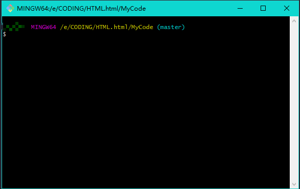
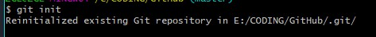

## 一.linux
1. 常用命令
    - ls 
        - 查看当前文件夹下的文件
    - cd  
        - 进入某一路径
        - 返回上一级 cd ..
        - 可以一次返回多级 cd ../../../
        - 进入主盘符(进入E盘) cd /e
        - 进入主目录 cd ~
    - clear 
        - 清除屏幕上的内容（ctrl + L）
    - mkdir 创建文件夹
        - 支持批量创建 mkdir a b c 
    - touch 
        - 创建文件（注意要写后缀，支持批量）
    - rm 
        - 删除文件，支持批量  删除的文件不进回收站
        - 删除文件夹  &nbsp;&nbsp;&nbsp;&nbsp;&nbsp;&nbsp;rm 文件夹 -r
        - 在linux下删除整个磁盘的命令（==慎用！！！==） ==rm / -rf==
    - mv 
        - 移动/重命名文件
        - mv 要移动的文件 目标文件夹(移动)
        - mv 要命名的文件 新的名字(重命名)
    - cat 
        - 查看文件内容
    - history 查看命令历史
        - ! + 命令对应的数字编号 调用该命令
    - vim
        - vim 文件名 >>>进入vim的命令模式
            - i 进入输入模式,编辑内容
            - esc 返回命令行模式
            - : 进入底线命令行模式
                - w 保存文件
                - q 退出vim模式
                - wq 同时输入,保存并退出vim模式
                - q!不保存退出vim模式
2. 小技巧
    - 上下方向键，可以查看历史命令，并配合回车，快速输入已经输入过的命令
    - ctrl + c 取消命令
    - ctrl + insert 命令行的复制
    - shift + insert 命令行的粘贴
    - Tab 自动补全文件名
    - 使用 -h/(--help)查看使用帮助

## 二.Git
1. git介绍 
 - git 是一款开源免费的分布式版本控制系统,是一个引用程序,具有其如下常用功能:
    - 代码备份
    - 版本回退
    - 协作开发
    - 权限控制

2. 安装git
- 在官网（https://git-scm.com/downloads） 下载对应的版本，进行默认安装。安装成功后会在菜单栏出现Git Base。双击出现类似如下图标：
    - 安装成功后，需要设置一下自己的名字和email
    ```git
        git config --global user.name "在这儿输入你的名字"
        git config --global user.email "在这儿输入你的邮箱"
    ```
    - 可以使用 git config -1 来查看配置信息
- 更改Git Base 的起始目录
    - 默认的Git Base起始位置一般指向电脑的根目录，如下图：
    - 但是git的操作一般都在一个自己建立的文件夹中进行。为了便于操作，可以将Git Base 的默认起始位置进行更改：
        - 右键Git Base图标，找到属性；先删除“目标”中.exe后边的字符串。
        - 在起始位置一行，输入自己的本地仓库地址。
3. git bash 基本操作

    0. git 的三个区域
        - 工作区 代码编辑区域
        - 暂存区 git add的目标位置
        - 仓库区 git commit的目标位置
    1. git init
        - 初始化本地仓库
        - 在Git base 的起始目录下运行 git init命令，将这个目录变成本地的仓库。出现下边的提示就带便创建成功了。可以看到我的本地仓库名字叫GitHub。最后的.git是隐藏的。一般是看不见的。
    
        - 配置.gitignore文件
            - 项目开发过程中有些文件不应该存储到版本库中,这个时候需要在与.git文件夹同级的位置配置.gitignore用于忽略这些文件，常见情况有:
                - 临时文件
                - 多谋体文件
                - 编辑器生成的配置文件
                - npm安装的第三方模块
            - 在.gitignore内部编写内时有如下几种情况：
                - 忽略固定的名称
                    - banner.mp3
                    - footer.mp4
                - 忽略所有指定后缀的文件
                    - *.swp
                - 忽略当前文件夹下特定的文件
                    - /4.test

   2. git add  
        - 将文件添加到暂存区
        - git add 文件名(带后缀)(对单个文件操作)
        - git add -A 批量添加
        - 在这个命令执行后一般不会提示信息，说明添加成功（Unix的哲学是“没有消息就是好消息”）
    3. git commit -m '写明改动内容' 
        
        - 将代码提交仓库区
    4. 将本地库和远程库建立链接
        
        - git remote add origin git@github.com:你的github账户名/你的远程库的名称.git
    5. 将本地仓库的代码提交到远程库
        
        - git push -u origin（远程库别名） master（要上传的本地分支名）
    6. git ls-files 查看暂存区的内容
    7. git status 版本状态查看
        ```
        On branch master 当前的分支位置
        nothing to commit, working tree clean 工作树上没有需要提交的文件
        ```
   
        - 红色表明此修改仅存在于工作区
        - 绿色表明此修改存在于工作区和暂存区
   
    8. git restore --staged 文件名 从暂存区中移出
    9. git restore 文件名 擦除修改
    10. git diff 查看工作区和暂存区的差异
    11. git diff --cached 查看暂存区和仓库区之间的差异
    12. git log 查看历史记录
    13. git log --oneline 简单显示版的历史记录查看
    14. git reset --hard 版本号 去到对应的历史版
        ==版本在切换前,要对工作区的内容进行提交,确保git status 的运行结果为working tree clean==
    15. git reflog 记录版本的操作
    16. 将不应该进仓库的文件的提交进仓库了的解决办法
        1. git rm --cached 文件名 >>删除该文件
        2. 配置.gitignore >>将对应的文件添加进该文件
        3. 重新添加、提交(git add / git commit)
4. 分支相关操作
    - 在进行分支之前，一定得有一次初始化提交(一般文件为readme.md)
    - git branch 
        - 查看所有分支(绿色为当前的分支位置)
    - git branch 分支名 
        - 新建分支
    - git checkout 分支名 
        - 切换分支
        - ==在进行切换分支前先要进行工作区提交==
    - git merge 分支名 
        - 将对应的分支名合并到当前分支上
    - git branch -d 分支名 
        - 删除分支
    - git checkout -b 分支名 
        - 创建并切换分支
- 分支冲突
    - 当多个分支修改同一个文件后，合并分支的时候就会产生冲突。
    - 如何确定当前仓库是否有冲突
        - 命令行最后的提示,信息为(master | merging),表明有冲突
        - git status ,信息中有both modified 表明有冲突
    - 解决
        - 定位产生冲突的文件(git status)
        - 修改冲突文件的内容为最终的结果
        - git add -A 和git commit 提交


## 三. GitHub
1. 介绍
   
    - GitHub 是一个Git仓库管理网站,可以创建远程中心仓库,为多人合作开发提供便利.
2. 操作流程
    1. 本地创建仓库,并做初始化提交
    2. 在GitHub上创建中心仓库
    3. 在本地命令行
    ```
    git remote add origin 'URL地址'
    git branch -M main
    git push -u origin master

    ```
3. git remote 命令
    - 是对中心仓库URL别名管理
    - add 添加
    - origin 别名的名称
    - 最后是URL地址
    1. git remote remove 别名(删除对应的别名)
    2. git remote -v
        -查看远程仓库的别名
    3. git remote rename 旧的别名  新的别名
4. git push 命令
    - git push -u origin master
    - 将本地仓库的某个分支推送到远程仓库中去
    - origin 远程仓库的别名 
    - 本地仓库的分支名
    - -u 分支关联
    - git push -f 强推


5. git clone 要克隆的目标网址
    - git clone 要克隆项目的目标网址 本地文件夹的期望名称(这个参数可以不要)
6. git pull
    - 更新指定分支的内容
    - git pull 仓库别名 本地分支名 
## 四. GitHub 多人合作

1. new orgnization 创建组织
    - 创建组织 ,邀请成员
    - member privileges 配置成员权限

2. 从项目克隆回来后,先切换分支,在分支上进行操作.然后在将自己的代码合并进分支,在提交