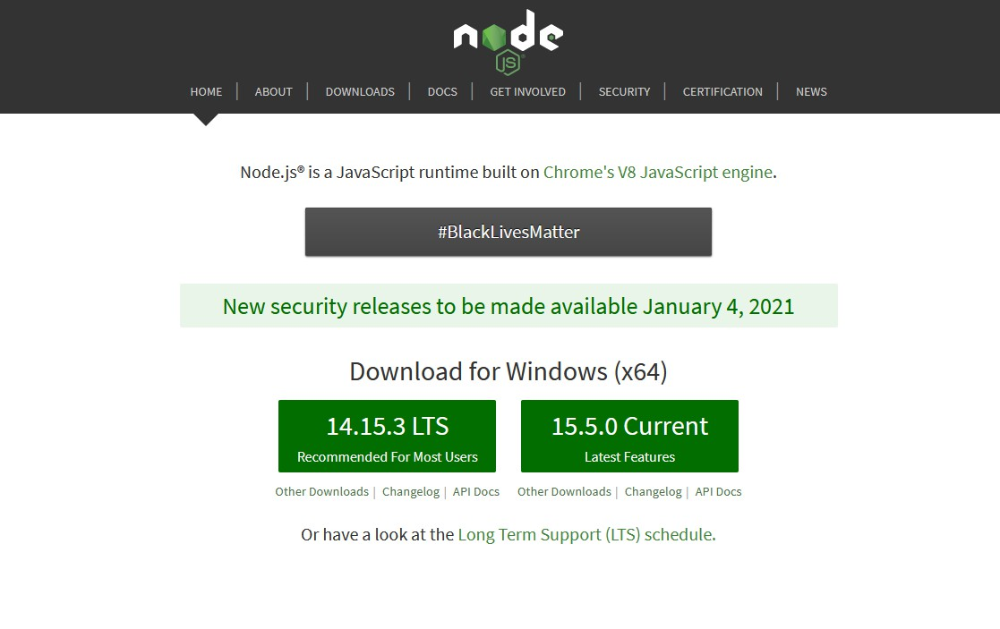
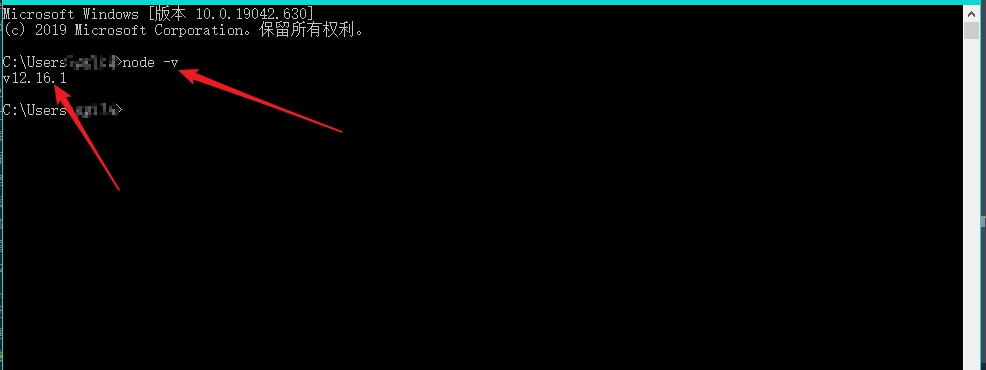

## 一、 介绍
Node.js是一个基于Chrome V8引擎的JavaScript运行环境，是一个应用程序。

## 二、 作用
- 解析运行JS代码
- 操作系统资源，如内存，硬盘，网络

## 三、 应用场景
- APP接口服务
- 网页聊天室
- 动态网站，个人博客，论坛，商城等
- 后端的Web服务，列如服务器端的请求（爬虫）、代理请求（跨越）
- 前端项目打包（webpack,gulp）
## 四 、node安装

工具一定要到官方下载，历史版本下载 <https://npm.taobao.org/mirrors/node/>

Nodejs 的版本号奇数为开发版本，偶数为发布版本，我们选择偶数号的 LTS 版本（长期维护版本 long term service）

双击打开安装文件，一路下一步即可😎，默认的安装路径是 `C:\Program Files\nodejs`。但是非常不建议安装到C盘，建议安装到D盘或者E盘，最好是固态盘上，已提供最好的运行速度。

安装完成后，在 CMD 命令行窗口（按下`windiws + r`组合键，弹出一个弹框，输入cmd 然后回车，出现命令行窗口）下运行 `node -v`，如显示版本号则证明安装成功，反之安装失败，重新安装。 

## 五、关于windows 命令行操作
- 切换盘符: 直接写盘符+冒号；例如: d: e:
- 进入对应目录：cd xxx/xxx
- 查看当前文件夹下的文件列表：dir
## 六、NODEJS 运行js文件的几种方法
1. 命令行运行
    - 打开命令行工具
    - 切换命令行位置到js文件所在的文件夹
    - 在命令行下输入命令`node` 进入nodejs的交互模式
    - 使用命令`node 文件名`执行
2. 命令行执行的另一种方式
    - VSCODE左侧文件列表中右键`在文件资源管理器中显示`
    - 在资源管理器的顶部文件路径栏中键入`cmd`,打开命令行窗口
    - 在命令行下输入命令`node` 进入nodejs的交互模式
    - 使用命令`node 文件名`执行

3. 在集成终端中打开 
    - 在vscode中，选择要运行的文件，右键`在集成终端中打开`
    - 然后使用命令`node 文件名`执行
4. 插件运行
    - 给 vscode安装code runner插件
    - 在vscode中，右键选择`run code`

#### 注意
在 nodejs 环境下，不能使用 BOM 和 DOM ，也没有全局对象 window，全局对象的名字叫 global

