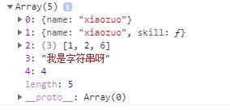
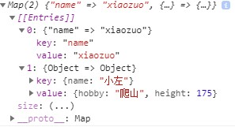
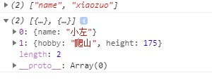

## 一、集合(Set)
ES6 提供了新的数据结构 Set（集合）。它类似于数组，**但成员的值都是唯一**的，集合实现了iterator接口，所以可以使用**扩展运算符** 和 `for…of…`进行遍历。

1. 声明集合
Set 本身就是一个构造函数，可通过 new Set() 生成一个 Set 的实例。在声明时，最好在集合中套一个数组，在向数组中添加数据。

```js
	let obj = {
		name:'xiaozuo',
		skill(){
			console.log('学习能力超强的')
		}
	}
        let s = new Set({name:'xiaozuo'});
	console.log(s);//Uncaught TypeError: undefined is not a function
	let s1 = new Set('我是字符串呀')
	console.log(s1);//Set(6) {"我", "是", "字", "符", "串", …}
	let s2 = new Set([])
	console.log(s2);//Set(0) {}
	let s3 = new Set(true)
	console.log(s3);//Uncaught TypeError: undefined is not a function
	let s4 = new Set(null)
	console.log(s4);//Set(0) {}
	let s5 = new Set(undefined)
	console.log(s5);//Set(0) {}
	let s6 = new Set(741)
	console.log(s6);//Uncaught TypeError: undefined is not a function
        let s7 = new Set([{name:'xiaozuo'},obj,[1,2,6],'我是字符串呀']);
	console.log(s7)
```

2. 获取集合中元素的个数(.size)
```js
    console.log(s7.size);//4
```
3. 向集合中添加数据(.add())
```js
s7.add(4)//添加
console.log（s7）;//Set(4) {{…}, {…}, Array(3), "我是字符串呀"，4}
```
4. 删除集合中的数据(.delete())
```js
s7.delete(4)//删除
console.log(s7.delete(1));//false
```
5. 判断某个数据是否在集合中(.has())
```js
console.log(s7.has(obj));//true
```
6. 清空集合中的所有数据(.clear())
```js
s2.clear()//清空集合
```
7. 使用for of遍历集合
```js
s7.delete(4);//添加一个元素
for(let v of s7){
    console.log(v)
}
```
遍历的结果为：


8. 扩展运算符
```js
let arr = [...s7]
console.log(arr);//[{…}, {…}, Array(3), "我是字符串呀", 4]
```

## 二、Map
ES6 提供了 Map 数据结构。它类似于对象，也是键值对的集合。但是**键**的范围不限于字符串，各种类型的值（包括对象）都可以当作键。Map也实现了iterator接口，所以可以使用**扩展运算符**和`for…of…`进行遍历。

1. 声明Map
```js
let m = new Map()
```
2. 向Map中添加元素(.set(键、值))
```js
    m.set('name', 'xiaozuo');
    let key = { name: '小左' };
    m.set(key, {
        hobby: '爬山',
        height: 175
    });
console.log(m)
```
以上的代码输出结果为：


3. 检测Map中元素的个数（.size()）
```js
console.log(m.size());//2
```

4. 获取Map中元素的值（.get()）

```js
console.log(m.get('name'));//xiaozuo
```
5. 删除Map中的某个元素(.delete())
```js
m.delete('name')
```
6. 检测某个数据是否在Map中（.has()）
```js
m.set('name','xiaozuo');
console.log(m.has('name'));//true
```
7. 清空Map中的数据
```js
m.clear()
```
8. 使用`for in` 遍历
```js
for(let v in m){
    consonle.log(v) //
}
```
以上遍历的结果为：

Map数据的`for in`遍历结果，每一次都**把键名和键值放在一个数组中，作为结果输出**

