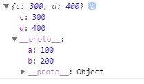

##　一 、 对象的拓展
### 1. Object.create（）
Object.create 方法可以以指定对象为原型创建新的对象，同时可以为新的对象设置属性, 并对属性进行描述
```js
    语法 Object.create(prototype, [descriptors])
    prototype：目标对象
    descriptiors:   新对象的描述
```
在第二个参数中，各属性的作用如下：
`value`:设置属性值
`writable`：标识当前的属性值是否可以修改。默认为false，不可修改
`configurable`：标识当前的属性值是否可以被删除。默认为false，不可删除
`enumerable`：标识当前的属性值是否可以枚举（遍历）。默认为false，不可遍历

```js
        var car = {
            name: '汽车'
        };

        var dazhong = Object.create(car, {
            // 第一种新增属性的方式
            brand: {
                value: '大众',
                writable: false,
                configurable: false,
                enumerable: false 
            },
            // 第二种新增属性的方式
            price: {
                //getter 函数
                // 当获取对象中的 price属性的时候, get方法将会自动执行, 并将return的值作为 price的属性值
                get: function(){
                    // some code here
                    return 280000;
                },
                //setter 函数
                //当对 price 属性进行赋值的时候, 会自动执行
                set: function(v){
                    // some code here
                    console.log('price 属性被修改了, 新的值为'+v);
                }
            }
        });
```

### 2. Object.defineProperties（）
直接在一个对象上定义新的属性或修改现有属性，并返回该对象。
```js
    Object.defineProperties(object, descriptors)
    object:要操作的对象
    descriptors:新增的描述对象
```

```js
// 定义对象
var star = {
    firstName: '刘',
    lastName : '德华'
};

// 为 star 定义额外的属性
Object.defineProperties(star, {
    fullName: {
        get: function(){
            return this.firstName + this.lastName;
        },
        set: function(name){
            var res = name.split('-');
            this.firstName = res[0];
            this.lastName = res[1];
        }
    }
});

// 修改 fullName 属性值
star.fullName = '张-学友';

// 打印属性
console.log(star.fullName);//打印输出张学友
```

###  3.简化对象写法
ES6 允许在大括号里面，直接写入变量和函数，作为对象的属性和方法。这样的书写更加简洁。
```js
    let name = 'xiaozuo';
    let age = 20;
    const obj = {
            //允许直接写变量
        name,
         age,
            // 在定义方法是:和function可以省略
        message( ){
            return (name+'的年龄是'+age+'岁')
        }
    }
    console.log(obj); //{name: "xiaozuo", age: 20, message: ƒ}
    console.log(obj.message());//xiaozuo的年龄是20岁
```

### 4. 判断两个值是否完全相等 Object.is(),约等于 ===
```js
console.log(Object.is(NaN,NaN)) //true
```
###　5. 对象的合并，返回目标对象.
```js
语法： Object.assign(目标对象，被合并的对象)
```
举例：
```js
const obj1 ={
    a :100,
    b:200
}

const obj2 = {
    c:300,
    d:400
}

const obj3 = {
    e:300,
    f:400
}
Object.assign(obj1,obj2,obj3)
console.log(obj1);//{a: 100, b: 200, c: 300, d: 400, e: 300, …}
```

### ６. 直接用___proto__设置原型
```js
const obj1 ={
    a :100,
    b:200
}

const obj2 = {
    c:300,
    d:400
}
obj2.__proto__ = obj1
console.log(obj2)
```
上述案列的输出如下：

可以看到obj1成为了obj2的隐式原型。
