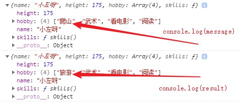

## 一、 数值扩展
1. 二进制和八进制
```js
let b = 0b1010;//10  b表示二进制
let o = 0o777;//511  O表示八进制
let x = 0xff;//255  x表示十六进制
```
2. Number.isFinite 检测一个数值是否为有限数
3. Number.isNaN 检测一个数值是否为NaN
4. Number.parseInt 字符串转整数
5. Math.trunc 去掉数字的小数部分
6. Number.isInteger 判断一个数是否为整数
7. 幂运算 Math.pow(2,3); // 8

## 二、 浅拷贝和深拷贝
拷贝就是复制，最常见的目标是：数组和对象
浅拷贝：只拷贝最外面一层的数据；更深层次的对象，只拷贝引用。在拷贝后的文件修改数据，原数据会受影响。
深拷贝：拷贝多层数据；每一层级别的数据都会拷贝。在拷贝后的文件修改数据，原数据不会受影响。
### 1. 浅拷贝
#### 数组的浅拷贝
1. 直接赋值
```js
let arr = [1,2,3,4]
let result =arr 
result[0] = 100;
console.log(arr);//[100,2,3,4]
console.log(result);//[100,2,3,4]
```

2. 数组的concat方法
```js
let arr = [{name:'xiaozuo'},2,3,4]
let result1 = [].concat(arr)
result1[0].name = 'xiaoyou';
console.log(arr);//[{name:'xiaoyou'},2,3,4]
console.log(result1);//[{name:'xiaoyou'},2,3,4]
```
3. 数组的slice方法
```js
let arr = [{name:'xiaozuo'},2,3,4]
let result2 = arr.slice(0)
result2[0].name = 'xiaoyou';
console.log(arr);//[{name:'xiaoyou'},2,3,4]
console.log(result2);//[{name:'xiaoyou'},2,3,4]
```
4. 扩展运算符...方法
```js
let arr = [{name:'xiaozuo'},2,3,4]
let result3 = [...arr]
result3[0].name = 'xiaoyou';
console.log(arr);//[{name:'xiaoyou'},2,3,4]
console.log(result3);//[{name:'xiaoyou'},2,3,4]
```

#### 对象的浅拷贝

```js
let message = {
    name :'小左呀',
    height:175,
    hobby:['爬山','武术'，'看电影','阅读']
}

let result = Object.assign({},message)

result.hobby[0] = '旅游'
console.log(message)
console.log(result)
```
拷贝的结果如下：


### 2. 深拷贝
1. 通过JSON实现
通过JSON实现深拷贝，该方式不能拷贝对象的方法。
```js
let message = {
    name :'小左呀',
    height:175,
    hobby:['爬山','武术'，'看电影','阅读'],
    skill(){
        console.log('超强的学习能力')
    }
}

// 通过message对象创建一个JSON格式的字符串
let json = JSON.stringify(message)

// 将JSON字符串创建一个新的对象
let result = JSON.parse(json)
result.hobby[0] = '旅游'
console.log(message)
console.log(result)
```


2. 递归实现深拷贝
```js
// 创建一个新的空对象
const result = {};
// 添加成员
result.name = message.name;
// hobby属性
result.hobby = [];
result.hobby[0] = shcool.hobby[0];
result.hobby[1] = shcool.hobby[1];
result.hobby[2] = shcool.hobby[2];
result.hobby[3] = shcool.hobby[3];

// skill 方法
result.skill = shcool.skill;
```

****将递归的方法进行函数封装，实现可复用。面试经常要求手写**
```js
	// 定义获取数据类型的函数
	function getDataType(data){
		return Object.prototype.toString.call(data).slice(8, -1);
	}
		
        //声明一个函数用来复制目标数据
        function deepClone(data){
            //判断目标数据是什么类型
            let type = getDataType(data);
            //初始化容器
            let container;
            //如果数据类型为对象
            if(type === 'Object'){
                container = {};
            }
            //如果数据类型为数组
            if(type === 'Array'){
                container = [];
            }
            //成员复制  遍历
            for(let i in data){
                //对键值类型进行判断
                let type = getDataType(data[i]);
                //判断
                if(type === 'Object' || type === 'Array'){
                    //递归调用 deepClone 函数
                    let result = deepClone(data[i]);
                    container[i] = result;
                }else{
                    container[i] = data[i];
                }
            }
            //返回新创建的数据
            return container;
        }
```
小试牛刀
```js
        //目标数据

    let message = {
        name :'小左呀',
        height:175,
        hobby:['爬山','武术'，'看电影','阅读'],
        skills(){
            console.log('超强的学习能力')
        }
    }

        //进行克隆
        const result = deepClone(message);
        result.hobby[0]= '旅游';
        console.log(message);
        console.log(result);
```
以上代码的执行结果为：

